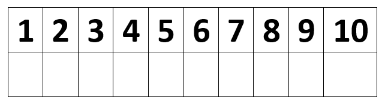

# vue_geogame

The **vue_geogame**. is a scavenger hunt like game App, written in Vue.js.
The data is store in Googles Firebase, for the Map it used Mapbox.

I start to develop this App, for a birthday party of a child in my neighborhood. At first, I create this Web-App and then I create the [Flutter App](https://github.com/Thro42/flutter_geogame).

Before you use the App, you must find some places, for hiding small boxes. In case you have two teams, the best strategy is
At the beginning two teams are formed. Let's say Team Red and Team Blue. Both teams start the APP and select their team in the APP. Now the first intermediate station appears on a map for each team. Each team has its own intermediate station and can only see these. If a team finds its waypoint, it will receive a code that it can enter in the APP. This code now makes the next stopover visible. At the same time, the current intermediate station is marked as found. All players, including those of the opposing team now see that a stopover has been found
There are two different waypoints. Code only and Mystery. Code only stations consist of a hidden sign with a code on it. Mystery Stations consist of a small container containing a note with one question and three answers. Here is an example.


Behind every answer there is a code and a number with an assigned character or number. The code is used to make the next station visible. The code is needed to find the actual treasure. Here, for the character or the digit must be transferred to a result developed as follows.



If, for example, answer 2 were correct, then a Y would have to be entered in the field. The trick is that each team can only find half of the characters or numbers. In order to find the actual treasure, they also need the digits and signs of the other team.

## Planning the game

In order to be able to plan the game better, we draw on experience from geocaching. In general, you can geocaching and thus our game operate everywhere. Please note, however, land rights and nature conservation. This makes hiding small doses in cities and nature reserves difficult.
In order to plan how many intermediate stations are needed, so the experience that must be scheduled between 5 and 10 minutes for an intermediate station. So, if you want that game to last an hour, you need 11 to 15 hiding places. And you do not need a real hiding place for the real treasure. Here is also a terminus at a hostel, where there are food and drinks. Code only stations usually take less time. The intermediate stations should at the beginning, divide the teams, but bring together again in the end, so that they then find the actual treasure together.

One should pick out the positions and remember the GPS positions. Put together a questionnaire

If you know all stations and their GPS positions, the administration page of the game can be accessed. Here you first set up an event account. This will later also be needed in the APPs and separates the actual games against each other. Subsequently, the individual stations are recorded on the page.

The app should be available for each platform and installed before the game. After installing and starting the app, players log in with the event account. This only has to be done once.

On ["How to upload data to Firebase Firestore Cloud Database"](https://medium.com/@impaachu/how-to-upload-data-to-firebase-firestore-cloud-database-63543d7b34c5), you found a way to fill the caches from a Excel list. A sample list you found hier [CachlisteSample.xlsx](./doc/CachlisteSample.xlsx)
You also can watch my repository [node_geogame](https://github.com/Thro42/node_geogame), wich shows how to load a list in to the database.

## Project setup

```
npm install
```

### Compiles and hot-reloads for development

```
npm run serve
```

### Compiles and minifies for production

```
npm run build
```

### Run your tests

```
npm run test
```

### Lints and fixes files

```
npm run lint
```

### Customize configuration

See [Configuration Reference](https://cli.vuejs.org/config/).
